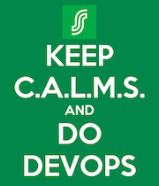

# SOK Development Guidelines  

This is a high-level documentation containing a collection of best practices, commonalities between projects and values proven to be practical. We're encouraging our own teams to follow these guidelines when implementing their software. Guidelines are developed by SOK development community.

See [Pages](https://s-group-dev.github.io/development-guidelines/) version of this content.

## Motivation

Following these guidelines promotes good adoption of our way of implementing software, reduces friction between teams and answers to many commonly asked questions. By implementing this standard it also helps to improve our software development quality and speed and share know-how.

## Usage

Feel free to use these guidelines as your guidance while implementing  software. Our own teams are. As standard can feel good, history proves that better conventions are to follow. As such, you should consider this to be a living document. Please see [CHANGELOG.md](CHANGELOG.md).

## More Resouces

- [Contributing](CONTRIBUTING.md)

## LICENSE

This work is licensed under a [Creative Commons Attribution 4.0 International License](http://creativecommons.org/licenses/by/4.0/). Please see [LICENCE file](LICENSE).
